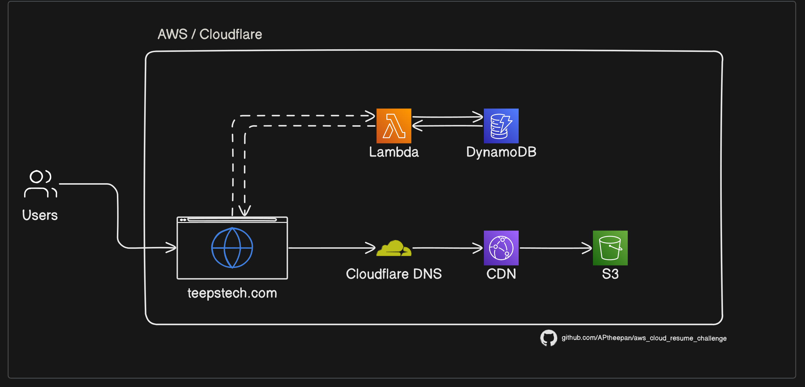
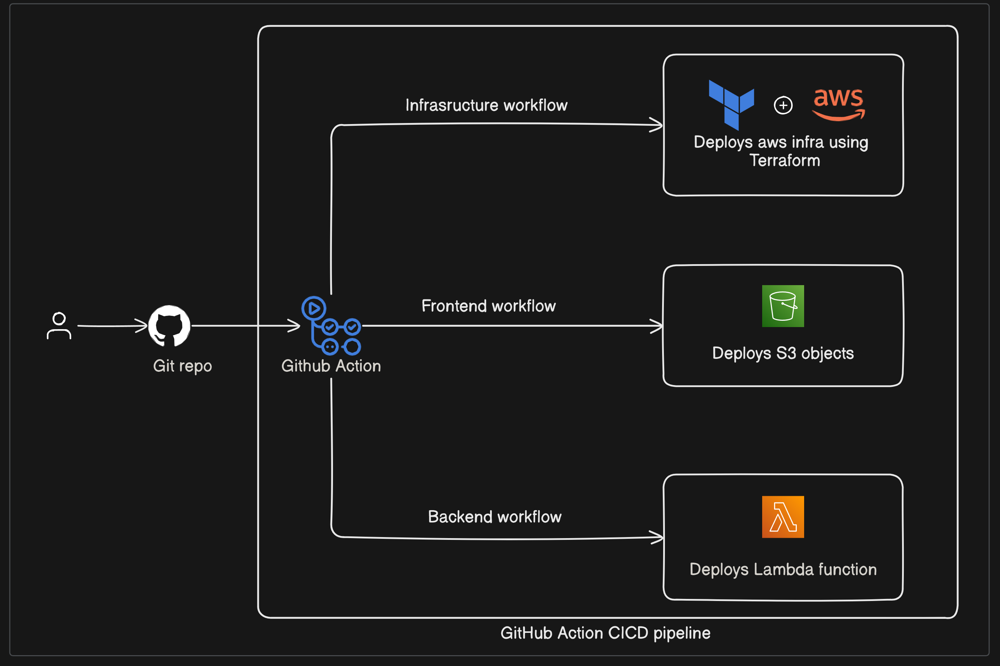

# AWS Cloud Resume Challenge

The [The Cloud Resume Challenge](https://cloudresumechallenge.dev/), created by Forrest Brazeal, is a multi-step project designed to help individuals build and showcase key cloud skills essential for a career in cloud computing.

This is my attempt at cloud resume challenge in AWS.
What is Cloud Resume Challenge? - [The Cloud Resume Challenge](https://cloudresumechallenge.dev/) is a multiple-step resume project which helps build and demonstrate skills fundamental to pursuing a career in Cloud. The project was published by Forrest Brazeal.

## Architecture

## CICD Pipeline Workflow

**Services Used**:

- Terraform
- python
- S3
- AWS CloudFront
- Certificate Manager
- CloudFlare
- AWS Lambda
- Linux
- Dynamo DB
- GitHub Actions CI/CD

